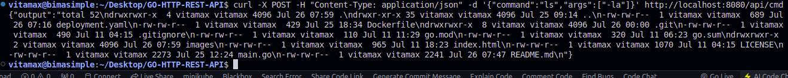
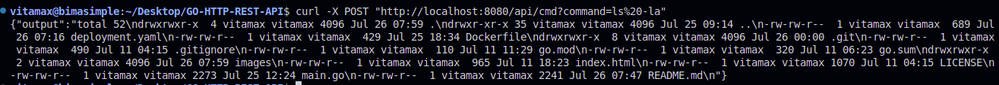
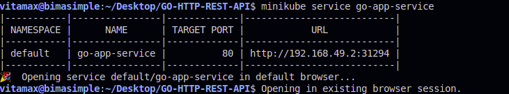

# GO-HTTP-REST-API
- A simple GO HTTP REST API that will accept a shell command and return the output of that command.

## Task
- Write a simple GO HTTP REST API that will accept a shell command and
return the output of that command.
- Create an endpoint with the POST method. api/cmd POST
- Accept the command via query param or JSON body.
Return the output of the command as a response.

**Plus point:**
- Return error if the command is not found, with proper status code.

## Requirements
- Downloading a binary release suitable for your system and then follow the installation instructions in GO documentation 
- In the task directory, intialize the module: `go mod init GO-HTTP-REST-API`
- With the module initialized, install the Gorilla Mux package `go get github.com/gorilla/mux` 
- Create a new file called `main.go` and add the following code in the file `main.go`
- Run the Go server: `go run main.go`
- You can test the API using curl:
### Testing the API POST REQUEST
- Using JSON body:
`curl -X POST -H "Content-Type: application/json" -d '{"command":"ls","args":["-la"]}' http://localhost:8080/api/cmd` hence output as shown in 

- Using query parameter:
`curl -v -X POST "http://localhost:8080/api/cmd?command=ls%20-la"` hence output shown in 

## Testing with Kubernetes

### Prerequisites
1. Docker
2. Minikube
3. kubectl

#### Steps
1. **Start Minikube:**
`minikube start --driver=docker`
2. **Check Minikube Status:**
`minikube status`
3. **Set kubectl Context to Minikube:**
`kubectl use-context minikube`
4. **Verify kubectl Context:**
`kubectl config get-contexts`
5. **Use Minikube Context:**
`kubectl config use-context minikube`
6. **Get Cluster Info:**
`kubectl cluster-info`
7. **Dump Cluster Info:**
`kubectl cluster-info dump`
8. **Deploy the Application**
- Apply the Deployment Configuration:
`kubectl apply -f deployment.yaml`
- Verify Deployment and Service:
`kubectl get pods`
- Access the Service as illustrated in :
`minikube service go-app-service` 
**Deployment Configuration**
The deployment configuration are witten in the `deployment.yaml`

**Notes**
1. Ensure your Docker image vitamax/go-http-rest-api:latest is pushed to Docker Hub or a container registry accessible by your Kubernetes cluster.
2. Resource limits are set to ensure the application does not consume excessive resources.